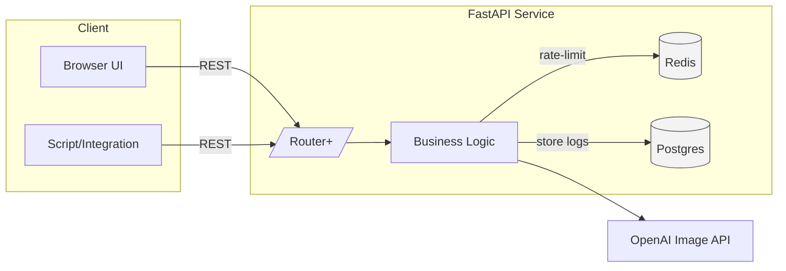

# Product Requirements Document (PRD)  
**Project Name:** *ArtGen FastAPI Service*  
**Prepared For:** TCCtech / ThaiBev AI Engineering Team  
**Last Updated:** 25 Apr 2025 (Asia/Bangkok)

---

## 1. Purpose

Build a lightweight service that exposes OpenAI’s **Image API** through a **FastAPI** backend and a minimalist web frontend.  
The service will let internal or external users:

1. Select an **image model** (DALL·E 2, DALL·E 3, GPT Image).  
2. Enter a **prompt** (and, optionally, editing assets or advanced parameters).  
3. Receive the generated, edited, or variant image for download or further processing.

---

## 2. Goals & Success Metrics

| Goal | KPI / Target |
|------|--------------|
| Provide reliable image generation with selectable models | ≥ 99% successful responses under 30 s for 1024×1024, *medium-quality* requests |
| Architect clean REST endpoints for later expansion (edits, variations, RAG) | Code climate score ≥ A; 80% unit-test coverage |
| Keep UI frictionless for designers / marketers | ≤ 10 s perceived TTFB; < 3 clicks from prompt to result |
| Secure usage & cost controls | No un-authenticated access; per-user token limits configurable |

---

## 3. Personas & User Stories

### 3.1 Personas
* **Creative Designer (Lisa)** – needs quick concept art variations for campaigns.  
* **Marketing PM (Somchai)** – reviews images and exports for slide decks.  
* **Backend Engineer (Arthit)** – integrates service into a larger content pipeline.

### 3.2 Key User Stories - *Generation-only scope*  

| ID | As a … | I want … | So that … |
|----|---------|----------|-----------|
| **US-01** | **Graphic Designer** | to select **GPT Image** and enter a detailed prompt describing the look I need | I can instantly get a high-quality hero image or poster concept |
| **US-02** | **Graphic Designer** | to adjust size (square, portrait, landscape) and quality before I hit “Generate” | the output fits my exact layout without extra cropping |
| **US-03** | **Marketer** | to choose **DALL·E 2** and request up to 10 variations in one click | I can explore multiple creative directions while keeping costs low |
| **US-04** | **Marketer** | to preview every generated image in a scrollable gallery and pick the best | I can decide quickly which visual aligns with the campaign |
| **US-05** | **PM / Content Editor** | to download the chosen image as PNG with optional transparent background | I can drop it straight into PowerPoint, Figma, or social templates |
| **US-06** | **Backend Engineer** | to call `/generate` programmatically with model, prompt, and output parameters | I can automate artwork production for newsletters and blogs |
| **US-07** | **Admin / Finance** | to view per-user request counts and token spend in a dashboard | I can monitor usage, flag abuse, and keep the monthly bill predictable |

**Scope note:** All stories focus on **new image creation**. There is **no user-supplied image upload or in-painting flow** in this MVP.

---

## 4. Functional Requirements

### 4.1 Backend (FastAPI)

| Endpoint | Method | Description | Params / Body |
|----------|--------|-------------|---------------|
| `/generate` | POST | Create an image from scratch | `model` (enum), `prompt`, `n` (default 1), `size`, `quality`, `format`, `background` |
| `/edit` | POST | Edit / in-paint an existing image | All of `/generate` **plus** `image` (file), `mask` (file, optional) |
| `/variation` | POST | Generate variations (DALL·E 2 only) | `image` (file), `n`, `size`, `format` |
| `/health` | GET | Liveness/readiness probe | — |
| `/metrics` | GET | Prometheus-style cost & latency metrics | — |

* **Async** calls to OpenAI with back-off & retry.  
* **Streaming** optional (future) via Server-Sent Events.  
* **API Key** stored as env var; never logged.  
* **Rate limiting** per user/org by Redis-based token bucket.  

### 4.2 Frontend (“ArtGen UI”)

* **Framework:** plain HTMX or small React/Vite bundle (< 50 kB gzipped).  
* **Layout:**  
  * Left panel — prompt textarea, model dropdown, advanced section (size, quality, background).  
  * Right panel — generated images grid, each with *Download* / *Copy URL* action.  
* **Theme:** light, neutral palette (white/gray), single accent color; mobile-first responsive.  
* **Error handling:** toast notifications for moderation blocks / rate limits.  

---

## 5. Non-Functional Requirements

| Category | Requirement |
|----------|-------------|
| **Performance** | P95 backend latency < 8 s for standard requests; scalable to 20 req/s burst. |
| **Security** | All endpoints behind Auth0 or internal SSO; HTTPS only. |
| **Observability** | Structured JSON logs, OpenTelemetry traces, Grafana dashboards (cost, TPS). |
| **Compliance** | Image + prompt logs retained ≤ 30 days; comply with OpenAI policy & Thai PDPA. |
| **Accessibility** | WCAG 2.1 AA for the UI (alt text, contrast, keyboard navigation). |

---

## 6. Technical Architecture



* Deployable container image (~ 150 MB).  
* Use **Gunicorn + Uvicorn workers** behind Traefik / Nginx.  
* Auto-scale on K8s (HPA on CPU + RPS).

---

## 7. Milestones & Timeline

| Phase | Deliverables | Owner | Target Date |
|-------|-------------|-------|-------------|
| 0. Kick-off | Tech spec sign-off | PM | **May 02** |
| 1. Backend MVP | `/generate` only (GPT Image) + unit tests | BE | May 16 |
| 2. Frontend Alpha | Prompt page + image gallery | FE | May 23 |
| 3. Model Switcher | Add DALL·E 2 & DALL·E 3; UI dropdown | BE/FE | May 30 |
| 4. Edits & Variations | `/edit`, `/variation` + mask upload | BE | Jun 06 |
| 5. Hardening | Auth, rate-limit, logging, docs | DevOps | Jun 13 |
| 6. UAT & Launch | Stakeholder review, bug-fixes, prod release | All | **Jun 20** |

---

## 8. Acceptance Criteria (UAT)

1. Selecting **GPT Image** + prompt returns a 1024×1024 PNG in < 30 s 9/10 times.  
2. Switching to **DALL·E 2** halves average cost vs GPT Image for the same prompt (verified by metrics).  
3. Edits endpoint correctly applies mask (transparent pixels replaced, filled remain intact).  
4. UI works on Chrome, Edge, Safari, iOS Safari, Android Chrome (≥ 95% global coverage).  
5. Unauthorized request returns HTTP 401 with JSON error schema.  

---

## 9. Risks & Mitigations

| Risk | Probability | Impact | Mitigation |
|------|-------------|--------|------------|
| OpenAI rate limits during heavy internal demos | Medium | High | Exponential back-off + queue + dashboard showing remaining quota |
| Prompt content blocked by moderation causing user confusion | Medium | Medium | Surface policy reason in UI; link to docs; allow prompt revision |
| Rising token cost for high-quality image bursts | Low | High | Budget alerts; auto-downgrade to *medium* after threshold |

---

## 10. Open Questions

1. Will we eventually expose **chat+image** via the upcoming *Responses API*?  
2. Which auth provider—Okta, Auth0, or existing SSO—should gate the service?  
3. Do we need a branded cache/CDN layer for large public traffic?

---

### Appendix A – Request / Response Schema (Draft)

```jsonc
POST /generate
{
  "model": "gpt-image-1",         // or "dall-e-3", "dall-e-2"
  "prompt": "Castle on a cliff at dawn",
  "n": 1,
  "size": "1024x1024",
  "quality": "medium",
  "format": "png",
  "background": "auto"
}
```

```jsonc
200 OK
{
  "id": "img_abc123",
  "created": 1745575400,
  "images": [
    {
      "b64_json": "<base64-string>",
      "filetype": "png",
      "size": "1024x1024"
    }
  ],
  "model": "gpt-image-1",
  "usage": {
    "prompt_tokens": 23,
    "image_tokens": 1056,
    "total_tokens": 1079
  }
}
```

---

*Prepared by ChatGPT (OpenAI o3) for initial planning. Feel free to mark up or request revisions.*